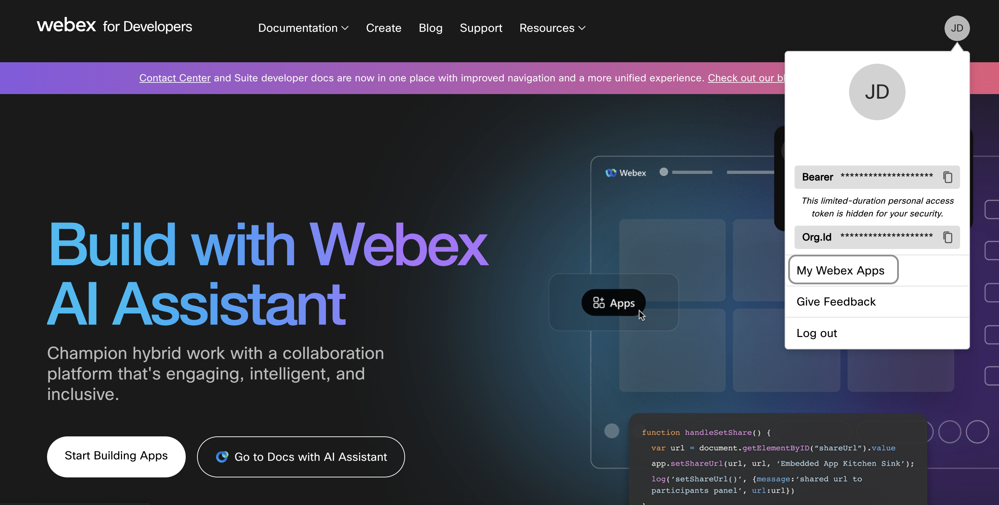
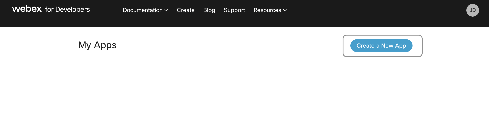
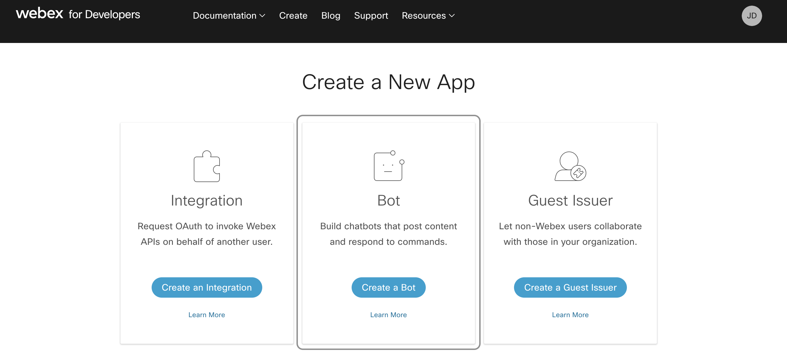
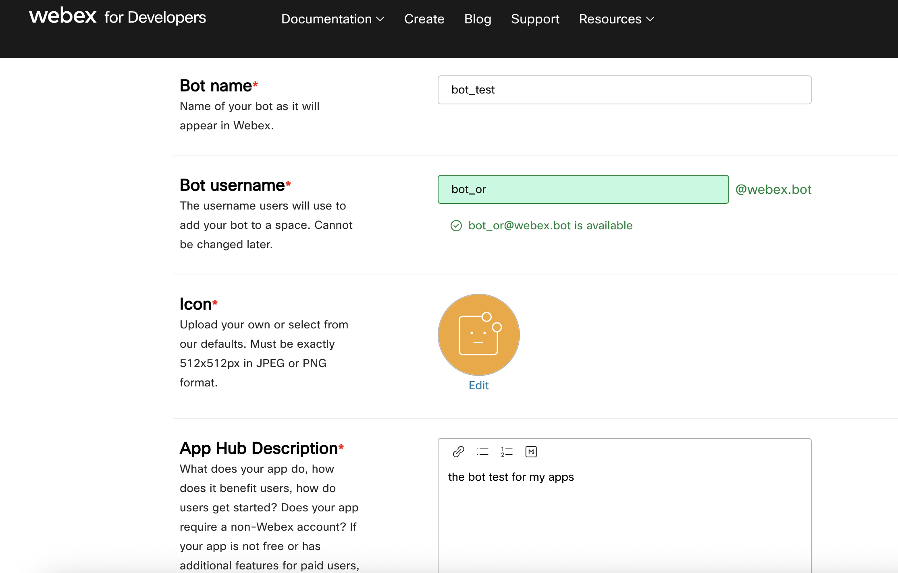
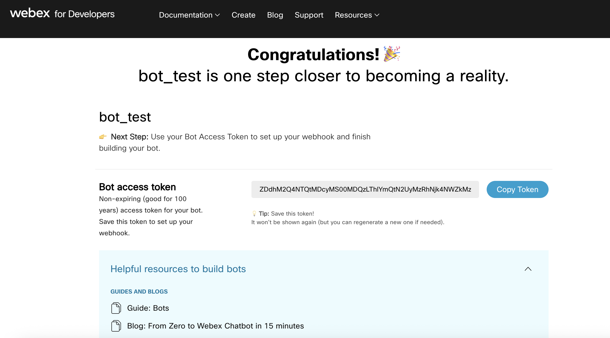
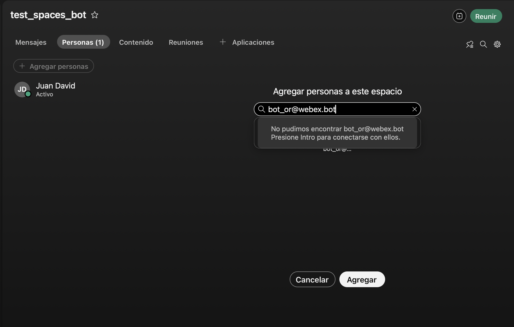
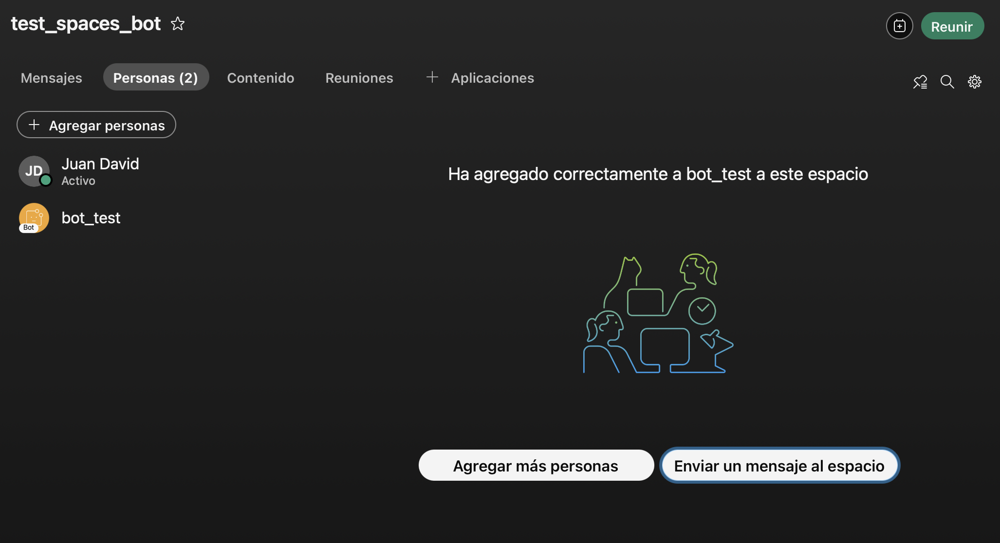
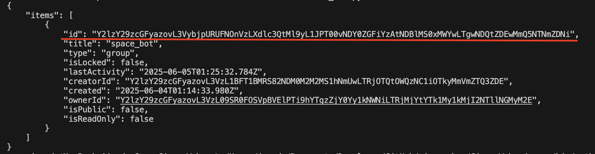
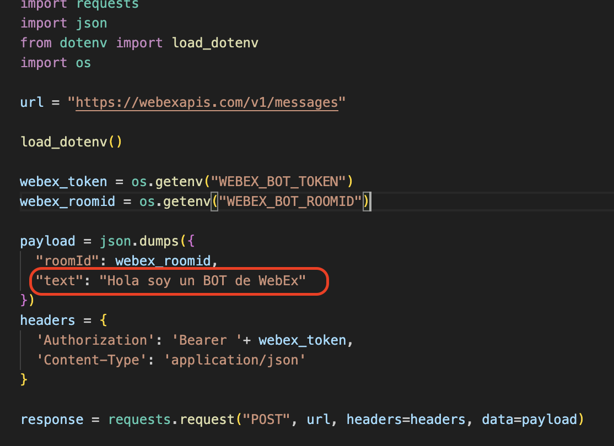
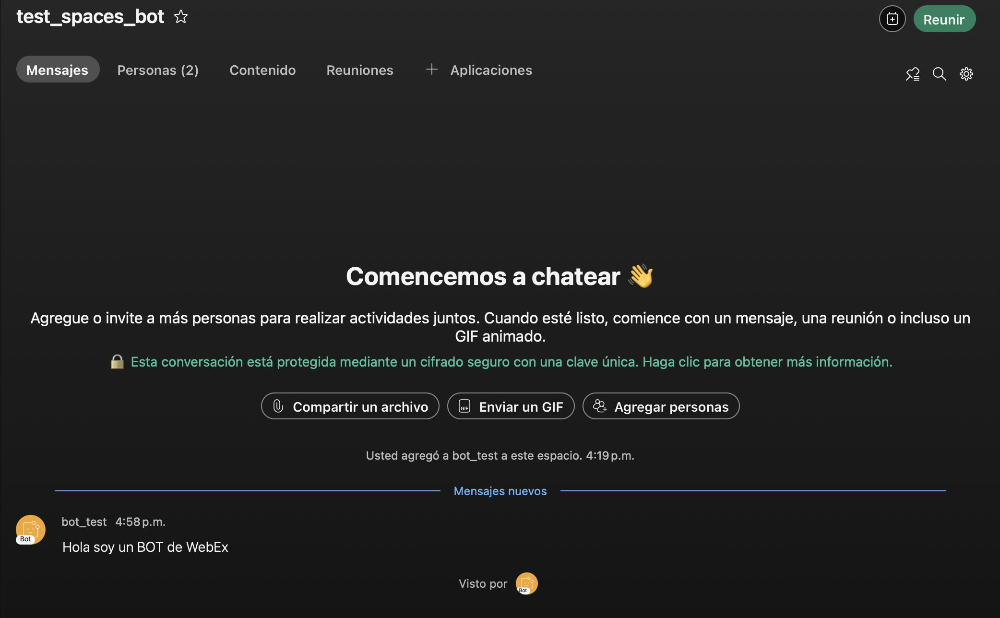

# Webex Bot con Python

Este proyecto muestra cómo crear un **bot de Webex** utilizando Python y las APIs oficiales de Webex.

---

## 🤖 ¿Qué es un bot de Webex?

Un bot es una aplicación que puede enviar y recibir mensajes en Webex, automatizando interacciones en espacios y facilitando flujos de comunicación.

---

## 🚀 Objetivo

Construir un bot que pueda:

- Escuchar mensajes en espacios Webex donde esté agregado
- Responder automáticamente a mensajes o comandos
- Gestionar eventos en tiempo real usando Webhooks

---

## 📚 Requisitos

- Cuenta Webex con un bot creado (https://developer.webex.com/my-apps)
- Token de acceso del bot
- Python 3.7+

---

## 🛠 Tecnologías usadas

- Python 3
- python-dotenv (para variables de entorno)
- requests (para llamadas API a Webex)

---

## 🔧 Cómo empezar

### 1. Crear un bot en Webex

- Ve a [My Apps](https://developer.webex.com/my-apps)
- Crea un nuevo bot y guarda el token de acceso

# 🤖 Crear un Bot en Webex

En esta sección aprenderás a crear un **Webex Bot** desde el portal de desarrolladores de Webex. Este bot nos permitirá realizar diversas integraciones utilizando un token de larga duración (hasta 100 años), ideal para desarrollo y pruebas iniciales.

> ⚠️ **Importante:** Aunque este token de larga duración es útil, también representa un riesgo de seguridad si cae en manos equivocadas. En caso de compromiso, deberás **regenerar manualmente** el token desde el portal. Más adelante exploraremos opciones más seguras para producción.

---

### 🛠 Paso 1: Ingresar al portal

Accede a tu portal de desarrollador en [developer.webex.com](https://developer.webex.com) y dirígete a la sección **My Webex Apps**, donde podrás visualizar, modificar o crear tus integraciones.



---

### 🧩 Paso 2: Crear una nueva aplicación

Haz clic en **"Create a New App"**.



---

### 🤖 Paso 3: Seleccionar tipo de aplicación

Selecciona la opción **"Create a Bot"**, ya que vamos a trabajar con un bot tradicional.



---

### ✍️ Paso 4: Configurar tu Bot

Rellena los siguientes campos:

- **`Bot Name`**: Nombre descriptivo para tu bot.
- **`Bot Username`**: Este será el identificador único que usarás para mencionar o llamar al bot dentro de los espacios Webex.
- **`Icon`**: Imagen de perfil del bot que aparecerá en los espacios.
- **`App Hub Description`**: Breve descripción sobre el propósito del bot o sus funcionalidades, útil para otros desarrolladores que lo mantendrán o integrarán.



---

### 🔑 Paso 5: Obtener el token de acceso

Una vez creado el bot, se mostrará un **token de acceso**.  
⚠️ **Este token solo se muestra una vez**, por lo tanto, **debes guardarlo en un lugar seguro**.  
Si en algún momento se ve comprometido, deberás **regenerarlo manualmente** y actualizar todas las integraciones que lo utilicen.



---

## ✅ ¡Bot creado!

Con esto, ya tienes listo tu **Webex Bot**, el cual podrás usar para automatizar tareas, responder mensajes, integrarte con APIs externas y mucho más.

Más adelante en este proyecto aprenderemos a:

- Enviar mensajes a un espacio Webex desde Python
- Crear integraciones más seguras usando OAuth2

# 🤖 Integración de un Bot en Webex

Una vez que has creado tu bot en Webex, puedes **agregarlo a un espacio de trabajo** (también llamado "space" o "room"). Al hacerlo, se genera un identificador único llamado `ROOM ID`, necesario para enviar mensajes automatizados.

Para integrar el bot a un espacio, simplemente **invítalo utilizando su `Bot Username` seguido de `@webex.bot`** en el espacio deseado.



Una vez agregado, podrás ver que el bot ya es parte del espacio. ¡Ahora estamos listos para comenzar con la automatización usando Python!



---

# 🤖 Automatización: Envío de Mensajes

## 🔍 Obtener ROOM ID

Ya con nuestro token del bot, el siguiente paso es **obtener el ROOM ID** del espacio. Este ID es necesario para que el bot sepa a qué espacio debe enviar mensajes.

Para hacerlo, usaremos el script [`rooms_bot.py`](rooms_bot.py). Solo necesitas agregar tu token al archivo `.env` bajo la variable `WEBEX_BOT_TOKEN`, luego ejecutar el script. La salida mostrará todos los espacios disponibles junto con sus ROOM IDs.

```env
WEBEX_BOT_TOKEN=your_token_here
```

Ejemplo de salida:



Ahora puedes completar tu archivo `.env` con las dos variables necesarias para enviar mensajes:

```env
WEBEX_BOT_TOKEN=your_token_here
WEBEX_BOT_ROOMID=your_room_id_here
```

---

## 📤 Enviar mensajes

Con el ROOM ID listo, puedes usar el script [`send_messages.py`](send_messages.py) para enviar mensajes al espacio.

Solo modifica el mensaje que deseas enviar dentro del script.



Ejecuta el script y recibirás el mensaje automáticamente en tu espacio Webex.



---

## 🚀 ¿Qué sigue?

¡Felicidades! Ya tienes una integración básica funcionando con Webex Bots usando Python.  
Esto abre la puerta a automatizaciones más poderosas. Por ejemplo, podrías conectar este sistema a herramientas de monitoreo como **Zabbix**, y enviar **alertas automáticas** a tus espacios de trabajo en Webex.

¿Te imaginas recibir notificaciones críticas directamente en tu grupo de soporte?  
Lo exploraremos más adelante... 😉